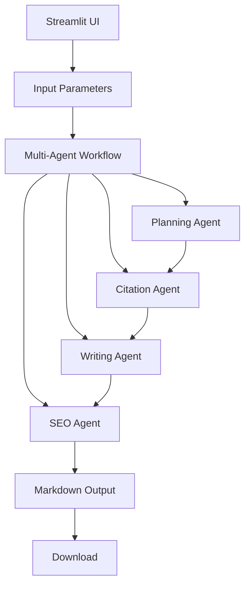
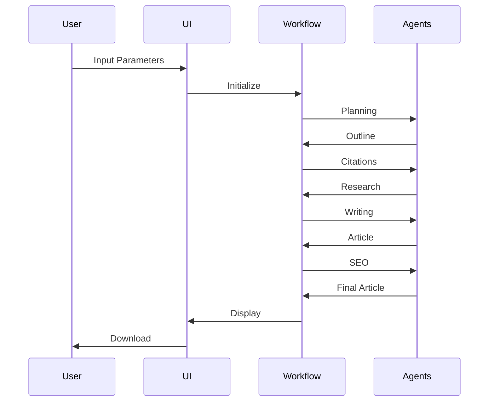

<h1 align="center">📝 Glyph: AI-Powered Article Generator</h1>

A sophisticated Streamlit application that generates well-structured articles using a multi-agent workflow powered by LangGraph. This tool combines AI planning, research, writing, and SEO optimization to create high-quality content.

## 🚀 Features

- ✍️ **Content Generation**
  - Input brief content and parameters
  - Select article tone and length
  - Option to include citations from the internet
  - Markdown preview and download

- 🤖 **Multi-Agent Workflow**
  - Planning agent: Creates detailed article outlines
  - Citation gathering agent: Researches using Tavily API
  - Writing agent: Generates well-structured content
  - SEO optimization agent: Enhances for search engines

## 🏗️ Architecture

### System Design



### Data Flow



## 🛠️ Technical Stack

| Component | Technology | Purpose |
|-----------|------------|---------|
| Frontend | Streamlit | User Interface |
| Workflow | LangGraph | Agent Orchestration |
| LLM | OpenAI GPT-4 | Content Generation |
| Search | Tavily API | Research & Citations |
| Format | Markdown | Content Structure |

## 📦 Dependencies

```python
# Core Dependencies
streamlit>=1.32.0
langgraph>=0.0.15
tavily-python>=0.3.1
python-dotenv>=1.0.0
langchain-openai>=0.0.5
```

## 🔧 Setup

1. **Environment Setup**
   ```bash
   # Create virtual environment
   python -m venv venv
   source venv/bin/activate  # On Windows: venv\Scripts\activate
   
   # Install dependencies
   pip install -r requirements.txt
   ```

2. **Configuration**
   Create a `.env` file:
   ```bash
   OPENAI_API_KEY=your_openai_api_key
   TAVILY_API_KEY=your_tavily_api_key
   ```

3. **Run Application**
   ```bash
   streamlit run app.py
   ```

## 🎯 Usage Guide

1. **Input Parameters**
   - Enter content brief
   - Select tone (Professional, Casual, Academic, etc.)
   - Choose article length (500, 1200, or 2500 words)
   - Toggle citations inclusion

2. **Generation Process**
   - Click "Generate Article"
   - Wait for AI processing
   - Preview generated content
   - Download as markdown

## 🔍 Code Structure

```
glyph/
├── app.py              # Streamlit UI and workflow orchestration
├── agents.py           # Multi-agent implementation
├── requirements.txt    # Dependencies
└── .env               # Environment variables
```

### Key Components

1. **ArticleGenerator Class**
   - Manages agent operations
   - Handles LLM interactions
   - Processes research and citations

2. **Workflow Graph**
   - Defines agent sequence
   - Manages state transitions
   - Handles error cases

## 🛡️ Error Handling

The application includes comprehensive error handling:
- Input validation
- API error recovery
- State management
- Graceful degradation

## 📊 Performance Considerations

- **Optimization Techniques**
  - Caching of API responses
  - Parallel processing where possible
  - Efficient state management
  - Resource cleanup

- **Scalability**
  - Modular agent design
  - Configurable workflow
  - Extensible architecture

## 🔄 Development Workflow

1. **Local Development**
   ```bash
   # Install development dependencies
   pip install -r requirements-dev.txt
   
   # Run tests
   pytest tests/
   
   # Format code
   ruff format .
   ```

2. **Version Control**
   - Follow semantic versioning
   - Maintain changelog
   - Document breaking changes

## 🤝 Contributing

1. Fork the repository
2. Create feature branch
3. Commit changes
4. Push to branch
5. Create Pull Request

## 📞 Support

For issues and feature requests, please use the GitHub issue tracker. 